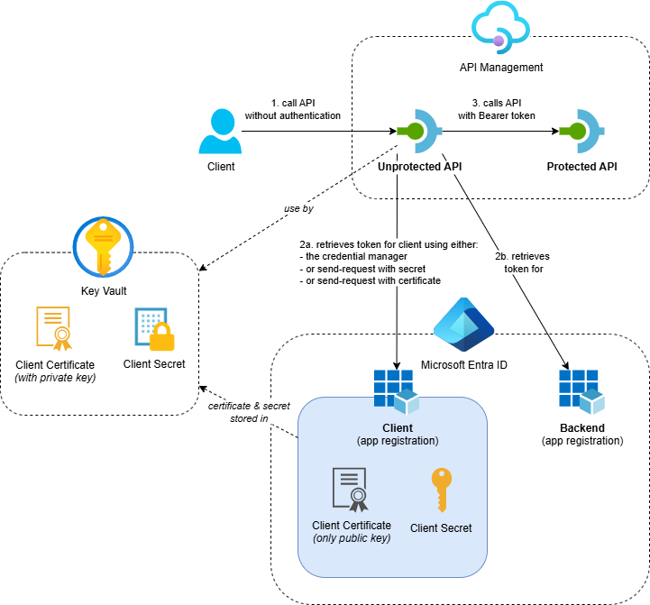

# Call API Management backend with OAuth

An Azure Developer CLI (`azd`) template using Bicep that shows multiple ways to call OAuth-protected backend APIs through Azure API Management. This template demonstrates three authentication scenarios: Credential Manager, send-request policy with client secret and send-request policy with client certificate (client assertion).

## Overview

This template deploys the following resources:



App registrations in Entra ID are created using the [Microsoft Graph Bicep Extension](https://learn.microsoft.com/en-us/community/content/microsoft-graph-bicep-extension) that represent the backend and the client.
A secret and certificate are created for the client app registration and stored in Azure Key Vault.

An API Management service is deployed with two APIs:

- **Protected API**: A backend API that's protected with OAuth. 
  It requires an access token to be retrieved from Entra ID before it can be called.  
  _(This example uses an API in the same API Management service, but this can be any API that requires OAuth authentication.)_

- **Unprotected API**: An API that's not protected with OAuth. 
  It can be called without an access token. This API demonstrates how to call the protected API using the following methods:

  1. Use the [Credential Manager](https://learn.microsoft.com/en-us/azure/api-management/credentials-overview) to retrieve an access token for the backend API.  
     See [credential-manager.bicep](src/apis/unprotected-api/credential-manager.bicep) for the Credential Manager configuration and [call-protected-api-using-credential-manager.xml](src/apis/unprotected-api/call-protected-api-using-credential-manager.xml) on how to use it in an API Management policy.

  1. Use the [send-request policy](https://learn.microsoft.com/en-us/azure/api-management/send-request-policy) to retrieve an access token for the backend API using the client credentials flow with a client secret.
     See [call-protected-api-using-send-request-with-secret.xml](src/apis/unprotected-api/call-protected-api-using-send-request-with-secret.xml) for the implementation of this policy.

  1. Use the [send-request policy](https://learn.microsoft.com/en-us/azure/api-management/send-request-policy) to retrieve an access token for the backend API using the client credentials flow with a certificate (client assertion).  
     See [call-protected-api-using-send-request-with-certificate.xml](src/apis/unprotected-api/call-protected-api-using-send-request-with-certificate.xml) for the implementation of this policy. 
     [Microsoft identity platform application authentication certificate credentials](https://learn.microsoft.com/en-us/entra/identity-platform/certificate-credentials) explains how to create a signed client assertion that can be used to retrieve an access token from Entra ID.


## Getting Started

### Prerequisites  

Before you can deploy this template, make sure you have the following tools installed and the necessary permissions.

**Required Tools:**
- [Azure Developer CLI (azd)](https://learn.microsoft.com/en-us/azure/developer/azure-developer-cli/install-azd)  
  Installing `azd` also installs the following tools:  
  - [GitHub CLI](https://cli.github.com)  
  - [Bicep CLI](https://learn.microsoft.com/en-us/azure/azure-resource-manager/bicep/install)  
- [PowerShell](https://learn.microsoft.com/en-us/powershell/scripting/install/installing-powershell) 
  _(This template has several hooks. See [this section](#hooks) for more information.)_
  
**Required Permissions:**
- You need **Owner** permissions, or a combination of **Contributor** and **Role Based Access Control Administrator** permissions on an Azure Subscription to deploy this template.
- You need **Application Administrator** or **Cloud Application Administrator** permissions to register the Entra ID app registrations. 
  _(You already have enough permissions if 'Users can register applications' is enabled in your Entra tenant.)_

### Deployment

Once the prerequisites are installed on your machine, you can deploy this template using the following steps:

1. Run the `azd init` command in an empty directory with the `--template` parameter to clone this template into the current directory.  

    ```cmd
    azd init --template ronaldbosma/call-apim-backend-with-oauth
    ```

    When prompted, specify the name of the environment (for example, `oauthbackend`). The maximum length is 32 characters.

1. Run the `azd auth login` command to authenticate to your Azure subscription _(if you haven't already)_.

    ```cmd
    azd auth login
    ```

1. Run the `azd up` command to provision the resources in your Azure subscription and Entra ID tenant. This deployment typically takes around 4 minutes to complete.

    ```cmd
    azd up
    ```

    See [Troubleshooting](#troubleshooting) if you encounter any issues during deployment.

1. Once the deployment is complete, you can locally modify the application or infrastructure and run `azd up` again to update the resources in Azure.

### Demo

The [Demo Guide](demos/demo.md) provides a step-by-step walkthrough on how to test and demonstrate the deployed resources.

### Clean up

Once you're done and want to clean up, run the `azd down` command. By including the `--purge` parameter, you ensure that the API Management service doesn't remain in a soft-deleted state, which could block future deployments of the same environment.

```cmd
azd down --purge
```

## Hooks

This template has several hooks that are executed at different stages of the deployment process. The following hooks are included:

### Post-provision hooks

These PowerShell scripts are executed after the infrastructure resources are provisioned.

- [postprovision-create-and-store-client-certificate.ps1](hooks/postprovision-create-and-store-client-certificate.ps1): 
  Currently, we can't create certificates for an app registration with Bicep.
  This script creates a self-signed client certificate for the client app registration in Entra ID and stores it securely in Azure Key Vault. 
  If the client certificate already exists in Key Vault, it won't create a new one.

- [postprovision-create-and-store-client-secret.ps1](hooks/postprovision-create-and-store-client-secret.ps1): 
  Currently, we can't create secrets for an app registration with Bicep.
  This script creates a client secret for the client app registration in Entra ID and stores it securely in Azure Key Vault. 
  If the client secret already exists in Key Vault, it won't create a new one.

- [postprovision-deploy-apis.ps1](hooks/postprovision-deploy-apis.ps1): 
  The APIs are defined in a [separate module](src/apis/apis.bicep) from the infrastructure 
  because the client secret and certificate must exist in Key Vault before deployment of the APIs.
  This script deploys the APIs to Azure API Management after the hooks that generate 
  the client secret and certificate have completed.

### Pre-down hooks

These PowerShell scripts are executed before the resources are removed.

- [predown-remove-app-registrations.ps1](hooks/predown-remove-app-registrations.ps1): 
  Removes the app registrations created during the deployment process, because `azd` doesn't support deleting Entra ID resources yet. 
  See the related GitHub issue: https://github.com/Azure/azure-dev/issues/4724.
  We're using a predown hook because the environment variables are (sometimes) empty in a postdown hook.
  
- [predown-remove-law.ps1](hooks/predown-remove-law.ps1): 
  Permanently deletes the Log Analytics workspace to prevent issues with future deployments. 
  Sometimes the requests and traces don't show up in Application Insights & Log Analytics when removing and deploying the template multiple times.
  A predown hook is used and not a postdown hook because permanent deletion of the workspace doesn't work
  if it's already in the soft-deleted state after azd has removed it.


## Troubleshooting

### API Management deployment failed because the service already exists in soft-deleted state

If you've previously deployed this template and deleted the resources, you may encounter the following error when redeploying the template. This error occurs because the API Management service is in a soft-deleted state and needs to be purged before you can create a new service with the same name.

```json
{
    "code": "DeploymentFailed",
    "target": "/subscriptions/00000000-0000-0000-0000-000000000000/resourceGroups/rg-oauthbackend-sdc-wiyuo/providers/Microsoft.Resources/deployments/apiManagement",
    "message": "At least one resource deployment operation failed. Please list deployment operations for details. Please see https://aka.ms/arm-deployment-operations for usage details.",
    "details": [
        {
            "code": "ServiceAlreadyExistsInSoftDeletedState",
            "message": "Api service apim-oauthbackend-sdc-wiyuo was soft-deleted. In order to create the new service with the same name, you have to either undelete the service or purge it. See https://aka.ms/apimsoftdelete."
        }
    ]
}
```

Use the [az apim deletedservice list](https://learn.microsoft.com/en-us/cli/azure/apim/deletedservice?view=azure-cli-latest#az-apim-deletedservice-list) Azure CLI command to list all deleted API Management services in your subscription. Locate the service that is in a soft-deleted state and purge it using the [purge](https://learn.microsoft.com/en-us/cli/azure/apim/deletedservice?view=azure-cli-latest#az-apim-deletedservice-purge) command. See the following example:

```cmd
az apim deletedservice purge --location "swedencentral" --service-name "apim-oauthbackend-sdc-wiyuo"
```
